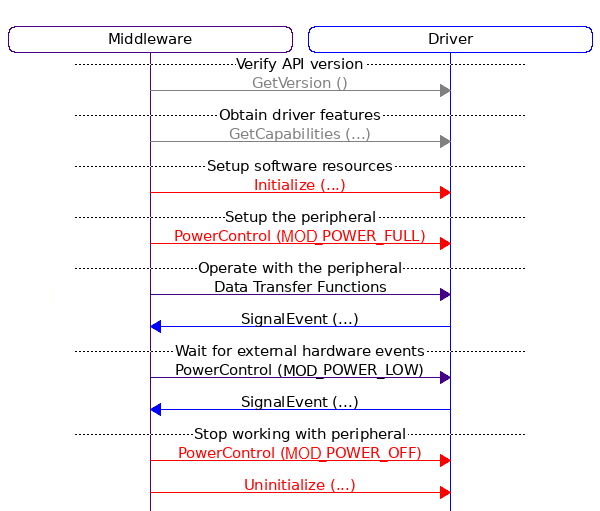

# Modem Driver

Driver API for LTE-FDD, LTE-TDD, and GPRS modules from Quectel (such as EG915, EC21, etc.) Based on the [ARM CMSIS-Driver](https://github.com/ARM-software/CMSIS-Driver), which can work on various ARM-based MCUs.

<p align="center">
  
</p>

<div align="center"> Figure 2 Block Diagram of the modem interface</div>

<br />
<br />

The following header files define the Application Programming Interface (API) for the Modem interface:

- **Driver\_Modem.h** : Driver API for Modem

The driver Modem provides access to the following interfaces:

- **Control interface** : setup and control the Modem module.
- **Management interface** : allows you to configure and manage the data connectivity on LTE-FDD, LTE-TDD, and GPRS networks.
- **Socket interface** : provides the interface to an IP stack that is running on the Modem module. This IP stack handles data communication. (Reserved for the next releases)
- **HTTP interface** : The HTTP interface is a lightweight Application Programming Interface (API) that is hosted in the Modem. The HTTP interface provides access to table data in the Modem through a structured URI format that uses HTTP POST, and GET requests.

The Modem interface usually requires CMSIS-RTOS features (i.e., mutex) and is often implemented with a peripheral device that is connected to the system using the SPI or UART interface.

<br/>
## Examples

HTTP GET Request:
```c
#define MODEM_FRAME_SIZE 1000

char http_response_buffer[MODEM_FRAME_SIZE];
const char HTTP_URL[] = "http://foo.bar";

int32_t status;
int32_t socket = -1;

MOD_CONTEXT_CONFIG tcp;
MOD_PDP_CONTEXT pdp;

MOD_DRIVER *modem = &MOD_DRIVER0;
MOD_HTTP_t httpd ={0};

modem->Initialize(NULL);
modem->PowerControl (MOD_POWER_FULL);

tcp.contextID = MOD_DEFAULT_CONTEXT;
tcp.context_type = MOD_PDP_CONTEXT_TYPE_IPV4;
tcp.APN = (uint8_t *)"mtnirancell"; 
socket = modem->Activate(&tcp, &pdp); //activate PDP context

if(socket < 0){
  return -1;
}
else if(pdp.state == MOD_PDP_CONTEXT_ACTIVATED){
  
  httpd.method = MOD_HTTP_GET;
  httpd.url = (uint8_t *)HTTP_URL;
  httpd.response = (uint8_t *)http_response_buffer;
  /* 
   * 
   * due to the limitations of the AT-Command protocol and for
   *  stability improvements, the length of the content should 
   * be retrieved from the header of the server response. 
   * 
   * for the server response without content-length,
   * response_length used as the reference.
   * 
   * */
  httpd.response_length = MODEM_FRAME_SIZE; 
  httpd.timeout = 80;
  httpd.resptime = 80;
  status = modem->HTTP(socket, &httpd);

  if(status > 0){
    // do something with the http_response_buffer
  }
}
```


<br/>
## Common Driver Functions

The modem driver is written to be compatible with standard CMSIS drivers, so each CMSIS API driver has the following functions:

- **GetVersion:**  can be called at any time to obtain version information of the driver interface.
- **GetCapabilities:**  can be called at any time to obtain capabilities of the driver interface.
- **Initialize:**  must be called before powering the peripheral using  **PowerControl**. This function performs the following:
  - allocate I/O resources.
    - register an optional  **SignalEvent**  callback function.
- **SignalEvent:**  is an optional callback function that is registered with the  **Initialize**  function. This callback function is initiated from interrupt service routines and indicates hardware events or the completion of a data block transfer operation.
- **PowerControl:**  Controls the power profile of the peripheral and needs to be called after  **Initialize**. Typically, three power options are available:
  - MOD\_POWER\_FULL: Peripheral is turned on and fully operational. The driver initializes the peripheral registers, interrupts, and (optionally) DMA.
  - MOD\_POWER\_LOW: (optional) Peripheral is in low power mode and partially operational; usually, it can detect external events and wake-up.
  - MOD\_POWER\_OFF: Peripheral is turned off and not operational (pending operations are terminated). This is the state after device reset.
- **Uninitialize:**  Complementary function to Initialize. Releases the I/O pin resources used by the interface.
- **Control:**  Several drivers provide a control function to configure communication parameters or execute miscellaneous control functions.

<br/>
### Cortex-M Processor Mode

The driver functions access peripherals and interrupts and are designed to execute in  **Privileged**  mode. When calling driver functions from RTOS threads, it should be ensured that these threads execute in  **Privileged**  mode.

<br/>
## Function Call Sequence

For normal operation of the driver, the API functions  **GetVersion** ,  **GetCapabilities** ,  **Initialize** ,  **PowerControl** ,  **Uninitialize**  are called in the following order:

<p align="center">
  
</p>

The functions  **GetVersion**  and  **GetCapabilities**  can be called any time to obtain the required information from the driver. These functions return always the same information.

<br/>
### Start Sequence

To start working with a peripheral the functions  **Initialize**  and  **PowerControl**  need to be called in this order:

```c
drv-\>Initialize (...); // Allocate I/O pins

drv-\>PowerControl (MOD\_POWER\_FULL); // Power up peripheral, setup IRQ/DMA
```

- **Initialize**  typically allocates the I/O resources (pins) for the peripheral. The function can be called multiple times; if the I/O resources are already initialized it performs no operation and just returns with  **MOD\_DRIVER\_OK**.
- **PowerControl**  (MOD\_POWER\_FULL) sets the peripheral registers including interrupt (NVIC) and optionally DMA. The function can be called multiple times; if the registers are already set it performs no operation and just returns with  **MOD\_DRIVER\_OK**.

<br/>
### Stop Sequence

To stop working with a peripheral the functions  **PowerControl**  and  **Uninitialize**  need to be called in this order:

```c
// Terminate any pending transfers, reset IRQ/DMA, power off peripheral
 drv-\>PowerControl (MOD\_POWER\_OFF);
 drv-\>Uninitialize (...); // Release I/O pins
```

The functions  **PowerControl**  and  **Uninitialize**  always execute and can be used to put the peripheral into a  **Safe State** , for example after any data transmission errors. To restart the peripheral in an error condition, you should first execute the  **Stop Sequence**  and then the  **Start Sequence**.

- **PowerControl**  (MOD\_POWER\_OFF) terminates any pending data transfers with the peripheral, disables the peripheral and leaves it in a defined mode (typically the reset state).
  - when DMA is used it is disabled (including the interrupts)
  - peripheral interrupts are disabled on NVIC level
  - the peripheral is reset using a dedicated reset mechanism (if available) or by clearing the peripheral registers
  - pending peripheral interrupts are cleared on NVIC level
  - driver variables are cleared
- **Uninitialize**  always releases I/O pin resources.


<br/>
### Access Struct:

The Modem Driver as a semi-standard CMSIS-Driver publishes an  **Access Struct**  with the data type name **MOD\_DRIVER\_xxxx** that gives to access the driver functions. (Driver\_Modem.h)

```c
/* Exported MOD_DRIVER# */
MOD_DRIVER MOD_DRIVER_(MOD_DRIVER_NUMBER) = {
  MOD_GetVersion,
  MOD_GetCapabilities,
  MOD_Initialize,
  MOD_Uninitialize,
  MOD_PowerControl,
  MOD_Activate,
  MOD_Deactivate,
  MOD_Context,
  MOD_HTTP_SetOption,
  MOD_HTTP_GetOption,
  MOD_SetURL,
  MOD_HTTP,
  MOD_Release,
  MOD_SSL_SetOption,
};
```

Note: socket related methods reserved for the next releases.

<br/>
<br/>
## Modem Control:

Control functions for the Modem module.

<br />
##### Typedef Documentation:

- ***MOD_SignalEvent_t***:
  - Pointer to MOD\_SignalEvent: Signal Modem Event (description below).
  - Provides the typedef for the callback function MOD\_SignalEvent.
  - Parameter for:
    - MOD\_Initialize

<br />
##### Function Documentation:

```c
•	MOD_DRIVER_VERSION MOD_GetVersion (void)
```

Get driver version **.**

**Returns**

- *MOD\_DRIVER\_VERSION*

**Notes**:

- The function returns version information of the driver implementation in *MOD\_DRIVER\_VERSION* **.**
- API version is the version of the driver specification used to implement this driver **.**
- Driver version is source code version of the actual driver implementation **.**


Example **:**

```c
extern MOD_DRIVER MOD_DRIVER0;

void get_version (void)  {
  MOD_DRIVER *modem = &MOD_DRIVER0;
  MOD_DRIVER_VERSION version;

  version = modem->GetVersion ();
  if (version.api < 0x100U) {        // requires at minimum API version 1.0 or higher
    // error handling
    return;
  }
}

```
<hr/>

```c
•	int32_t MOD_Initialize (MOD_SignalEvent_t cb_event)
```

Initialize Modem Module **.**

**Parameters**

- **[*in*]** cb\_event: Pointer to *MOD\_SignalEvent*

**Returns**

- execution status
  - *MOD\_DRIVER\_OK* **:** Operation successful
  - *MOD\_DRIVER\_ERROR* **:** Operation failed

This function is called when the RTOS starts operation and performs the following operations **:**

- Initializes the resources **and** peripherals required **for** the module **.**
- Registers the **MOD\_SignalEvent\_t** callback function **.**

The parameter cb\_event is a pointer to the **MOD\_SignalEvent** callback function **;** use a **NULL** pointer when no callback signals are required **.**

Example **:**
```c
extern MOD_DRIVER MOD_DRIVER0;
 
void initialize_modem (void) {
  MOD_DRIVER *modem = &MOD_DRIVER0;

  // Initialize and Power-on Module
  modem->Initialize (NULL);
  modem->PowerControl (MOD_POWER_FULL);
 
}

```
<hr/>

```c
•	int32_t  MOD_Uninitialize 	(void)  
```

De **-** initialize Modem Module **.**

**Returns**

- execution status
  - *MOD\_DRIVER\_OK*: Operation successful
  - *MOD\_DRIVER\_ERROR*: Operation failed

The function de **-** initializes the resources of the Modem module.

The MOD\_Uninitialize dunction is called when the middleware component stops operation **and** releases the software resources used by the module **.**

Example **:**
```c
extern MOD_DRIVER MOD_DRIVER0;

void uninitialize_modem (void) {
  MOD_DRIVER *modem = &MOD_DRIVER0;
 
  // Power off and De-initialize Module
  modem->PowerControl (MOD_POWER_OFF);
  modem->Uninitialize ();
}

```
<hr/>

```c
•	int32_t 	MOD_PowerControl 	(MOD_POWER_STATE	 state)
```

Control Modem Module Power **.**

**Parameters**

- **[**in**]** state: Power state
  - *MOD\_POWER\_OFF*: Power off **:** no operation possible
  - *MOD\_POWER\_LOW*: Low **-** power sleep mode **;**
  - *MOD\_POWER\_FULL*: Power on **:** full operation at maximum performance

**Returns**

- execution status
  - *MOD\_DRIVER\_OK*: Operation successful
  - *MOD\_DRIVER\_ERROR*: Operation failed
  - *MOD\_DRIVER\_ERROR\_UNSUPPORTED:* Operation **not** supported
  - *MOD\_DRIVER\_ERROR\_PARAMETER*: Parameter error **(**invalid state**)**

The function allows you to configure the power modes of the Modem module and the parameter state specifies the MOD\_POWER\_STATE **.**

**Notes**:

- **In** sleep mode waking up the main UART by AT command is supported.
- **In** sleep mode, if the flow control of the main UART is **not** enabled **,** too much data (more than 127 bytes) cannot be sent to the module through the main UART directly **.** You need to exit from the sleep mode before sending too much data **,** otherwise **,** the data may be lost **.**
- **If** power state specifies an unsupported mode **,** the function returns *MOD\_DRIVER\_ERROR\_UNSUPPORTED* as status information **and** the previous power state of the peripheral is unchanged **.** Multiple calls with the same state generate no error **.**

<hr/>


```c
•	void 	MOD_SignalEvent (uint32_t    event,
                              void *  arg 
                             )       
```

Signal Modem Events **.**

**Parameters**

- **[**in**]** event: Modem Events notification mask
- **[**in**]** arg: Pointer to argument of signaled event

**Returns**

- none

The function *MOD\_SignalEvent* is a callback function registered by the function *MOD\_Initialize* **.**

It is called by the Modem driver to notify the application about Modem Events occurred during operation **.**

**Notes**:

- The parameter event indicates the event that occurred during driver operation **.**
- The parameter arg provides additional information about the event **.**

The following events can be generated **:**

- *MOD\_EVENT\_CONNECT reserved* **.**
- *MOD\_EVENT\_DISCONNECT reserved* **.**
- *MOD\_EVENT\_ETH\_RX\_FRAME reserved* **.**
- *MOD\_EVENT\_READY Occurs after RF failures* **and** modem soft reset **.**

<br />
<br />

## Modem Management:

The Modem Management functions are used to configure and manage the connection to an access point (AP). They are also used to configure and manage the access point (AP) itself.

<br />

##### Data Structure Documentation:


- ###### MOD\_PDP\_CONTEXT

  Provides information about the network that the PDP context is connected to.

  **Used in**:

  - MOD\_Activate

  **Data Fields**:

  - <span style="color:red">uint8\_t</span> **id** **:**
    - PDP connection ID

  - <span style="color:red">MOD\_PDPContextState\_t</span> **state** **:**
    - current PDP context state:
      - MOD\_PDP\_CONTEXT\_ACTIVATED
      - MOD\_PDP\_CONTEXT\_DEACTIVATED
  - <span style="color:red">MOD\_PDPContextType\_t</span> **type** **:**
    - The protocol types
      - *MOD\_PDP\_CONTEXT\_TYPE\_IPV4*
      - *MOD\_PDP\_CONTEXT\_TYPE\_IPV6*
      - *MOD\_PDP\_CONTEXT\_TYPE\_IPV4V6*

  - <span style="color:red">uint8\_t</span>  **remote\_ip4** [**4**]:
    - Remote IP address

  - <span style="color:red">uint16\_t</span>    **remote\_ip6** [**6**]:
    - Remote IP6 address

<hr />

- ###### MOD\_CONTEXT\_CONFIG

  AP context configuration. Provides information needed to configure a PDP context.

  **Used in**:

  - *MOD\_Activate*

  **Data Fields**:

  - <span style="color:red">uint8\_t</span>  **contextID**:
    - Integer type. The context ID. 
    - Range: *MOD\_CONTEXT\_CONFIG\_IDMIN – MOD\_CONTEXT\_CONFIG\_IDMAX*

  - <span style="color:red">MOD\_PDPContextType\_t</span> **context\_type**:
    - Integer type. The protocol types
      - MOD\_PDP\_CONTEXT\_TYPE\_IPV4
      - MOD\_PDP\_CONTEXT\_TYPE\_IPV6
      - MOD\_PDP\_CONTEXT\_TYPE\_IPV4V6

  - <span style="color:red">uint8\_t</span> **\*** **APN**:
    - access point name

  - <span style="color:red">uint8\_t</span> **\*** **username**:
    - String type. The username. The maximum length: 127 bytes

  - <span style="color:red">uint8\_t </span>**\*** **password**:
    - String type. The password. The maximum length: 127 bytes.

  - <span style="color:red">MOD\_PDPContextAuthentication\_t</span> **authentication**:
    - Integer type. The authentication methods.
      - *MOD\_PDP\_CONTEXT\_AUTHENTICATION\_CHAP*
      - *MOD\_PDP\_CONTEXT\_AUTHENTICATION\_PAP*
      - *MOD\_PDP\_CONTEXT\_AUTHENTICATION\_NONE*

<br />


##### Function Documentation:

```c
•	int32_t	MOD_Activate	(	MOD_TCPIP_CONTEXT *    context,
						MOD_PDP_CONTEXT   *    PDP)
```


Activate interface (PDP Context).

**Parameters**

- **[**in**]** context:
  - AP context configuration. Provides information needed to configure a PDP context.
  - The value of *MOD\_ACTIVATE\_DEFAULT*, can used to activate default PDP context (specified by *MOD\_CONTEXT\_CONFIG\_DEFAULT* macro).

- **[**out**]** PDP:
  - Provides information about the network that the PDP context is connected to.

**Returns**

- status information
  - Socket identification number (\>=0)
  - *MOD\_DRIVER\_ERROR*: Operation failed
  - *MOD\_DRIVER\_ERROR\_PARAMETER*: parameter error

The function MOD\_Activate activates a PDP context based on the context configuration parameter with type of MOD\_TCPIP\_CONTEXT.

**Note** for the EG915 modem:

- When VoLTE is disabled or not supported, the range of \<contextID\> is 1–7.
- when VoLTE is enabled, the range of \<contextID\> is 1–5, and the module supports a maximum of 5 PDP contexts activated.
- The actual number of activated PDP contexts depends on the (U)SIM card.


Example **:**

```c


extern MOD_DRIVER MOD_DRIVER0;
  void activate_modem (void) {
  MOD_DRIVER *modem = &MOD_DRIVER0;
  // Initialize and Power-on Module
  modem->Initialize (NULL);
  modem->PowerControl (MOD_POWER_FULL);
  socket = modem->Activate(MOD_ACTIVATE_DEFAULT, &pdp);
  printf("Context ID= %d", pdp.id);
  printf("Context IP4= %d, %d, %d, %d", 	pdp.remote_ip4[0], 
                                        		pdp.remote_ip4[1], 
                                        		pdp.remote_ip4[2], 
                                        		pdp.remote_ip4[3]);
}
```

<hr/>

```c
•	int32_t MOD_Deactivate (int32_t socket)
```

Deactivate interface (PDP Context).

**Parameters**

- **[**in**]** int32\_t socket: PDP socket ID.


**Returns**

- execution status
  - *MOD\_DRIVER\_OK*: Operation successful
  - *MOD\_DRIVER\_ERROR*: Operation failed
  - *MOD\_DRIVER\_ERROR\_PARAMETER*: Parameter error (invalid interface)

The function *MOD\_Deactivate* deactivates a specific context and closes all TCP/IP connections set up in this context Depending on the network.

The argument socket specifies a PDP socket identification number returned from a previous call to MOD\_Activate.

<hr />

```c
•	int32_t MOD Context (MOD_CONTEXT_CONFIG * context)
```

Get/Set PDP context status/configuration.

**Parameters**

- **[**in/out**]** MOD\_CONTEXT\_CONFIG **\*** context.


**Returns**

- execution status
  - *MOD\_DRIVER\_OK*: Operation successful
  - *MOD\_DRIVER\_ERROR*: Operation failed
  - *MOD\_DRIVER\_ERROR\_PARAMETER*: Parameter error (invalid interface)

**Note**:

- The contextID field in the context structured parameter is required in both getter/setter modes, but if the contextID has a NULL value, then the default value (*MOD\_CONTEXT\_CONFIG\_DEFAULT*) is selected.
- The argument context(in *MOD\_Context* as a getter function) can be used to retrieve the current configurations of the specified PDP context (with the contextID field) of the Modem module.
- The argument context in the *MOD\_Context* as a setter function can be used to specify the PDP context settings.

<br>
<br>


## HTTP Interface:

The HTTP Interface exposes a set of API endpoints that accept parameters & payloads and return the results.
 This document describes the API actions that can be used by HTTP requests, detailing their URLs, inputs and outputs.

<br />
<br />

##### Typedef Documentation:

- ###### HTTP\_ResponseCallback\_t
  - Pointer to HTTP\_ResponseCallback function.
  - Provides the typedef for the callback function HTTP\_ResponseCallback.
<br />
- ###### HTTP\_RequestCallback\_t
  - Pointer to HTTP\_RequestCallback  function.
  - Provides the typedef for the callback function HTTP\_RequestCallback.

<br />
<br />

##### Data Structure Documentation:


- ###### MOD\_HTTP\_t

  HTTP connection configuration profile.

  **Used in**:

  - MOD\_HTTP

  **Data Fields**:

  - <span style="color:red">unsigned</span>  **method**: HTTP request method
    - MOD\_HTTP\_POST
    - MOD\_HTTP\_GET

  - <span style="color:red">uint8\_t\*</span>  **url**: The URL of an HTTP request.
  - <span style="color:red">uint32\_t</span>  **url\_length**: length of the URL
    - optional : on an ASCII-based URL, the url\_length parameter can be NULL.

  - <span style="color:red">uint8\_t\*</span>  **data**: Pointer to HTTP content buffer.
    - optional: The HTTP content can be omitted with a NULL value.
    - optional: if needed to send fragmented data. (Refer to the data\_callback)
  - <span style="color:red">uint32\_t</span>  **data\_length**: Length of the request content.
    - required if needed to send fragmented data.
    - optional:
      - data length in an ASCII-based data type can have a NULL value.
      - the data\_length can be omitted with a NULL value.

  - <span style="color:red">uint8\_t\*</span> **response**: HTTP response buffer.
    - optional: The HTTP response can be omitted with a NULL value.
  - <span style="color:red">uint32\_t </span> **response\_length**: maximum length of the response content.
    - required in a non-null response buffer.
    - on the server response without content-length, response\_length used as the reference.

  - <span style="color:red">HTTP\_RequestCallback\_t</span>  **data\_callback**:
    - HTTP request callback that used to send fragmented HTTP content.
    - optional: The data\_callback can be omitted when the data buffer exists.
    - If taken, data\_length indicates the total amount of data needed to send.

  - <span style="color:red">HTTP\_ResponseCallback\_t</span>  **response\_callback**:
    - HTTP response callback that is used to retrieve fragmented HTTP content.
    - optional: response\_callback can be removed when the total response size is less than the buffer size.
    - If taken
      - The response\_length indicates the maximum chunk size of the response data.
      - The response buffer size must be greater than 2 x response\_length. (dual buffer data management)

  - <span style="color:red">MOD\_Header\_t \* </span> **header**: HTTP header configuration structure.
    - simple field formatter that allows to format pair name/value fields as a header
  - <span style="color:red">unsigned</span>  **response\_header**: Disable or enable to output HTTP(S) response header
    - MOD\_HTTP\_ENABLE
    - MOD\_HTTP\_NORESP

  - <span style="color:red">uint32\_t </span> **timeout**: The maximum time for inputting HTTP(S) POST body or HTTP(S) POST request information.
    - optional: With the value NULL, the default modem timeout will be selected.
  - <span style="color:red">uint32\_t</span>  **resptime**: It is used to configure the timeout for the HTTP(S) response (Range: 1–65535 for EG915)
    - optional: With the value NULL, the default modem timeout will be selected.

<br />

- ###### MOD\_Header\_t

  HTTP request header type.

  **Used in**:

  - MOD\_HTTP

  **Data Fields**:

  - <span style="color:red"> HTTP\_HeaderField\* </span>  **fields**: header fields.
  - <span style="color:red"> uint32\_t</span> **nfield**: number of header fields
  - <span style="color:red"> char\*</span> **buffer**: header formatter with minimum size of
    - sizeof(fields)+sizeof(HTTP URL)+60

<br />

- ###### HTTP\_HeaderField

  HTTP header fields are a list of strings sent and received by both the client program and server on every HTTP request and response.
  <br />
  **Note**: The standard imposes no limits to the size of each header field name or value, or to the number of fields. However, most servers, clients, and proxy software impose some limits for practical and security reasons. 
  For example, the Apache 2.3 server by default limits the size of each field to 8,190 bytes, and there can be at most 100 header fields in a single request.
  <br />

  **Used in**:

  - MOD\_HTTP

  **Data Fields**:

  - <span style="color:red"> char\*</span>  **name**: Header field name
    - Header field names are case-insensitive. This is in contrast to HTTP method names (GET, POST, etc.), which are case-sensitive
  - <span style="color:red"> char\*</span>  **value**: Header field value

<br />
<br />

##### Function Documentation:

```c
•	int32_t MOD_HTTP_SetOption (MOD_HTTPOption_t option, void *data)
```

Set HTTP options.

**Parameters**

- **[**in**]** option: Option to set
- **[**in**]** data: Pointer to data relevant to selected option

**Returns**

- execution status
  - *MOD\_DRIVER\_OK*: Operation successful
  - *MOD\_DRIVER\_ERROR*: Operation failed
  - *MOD\_DRIVER\_ERROR\_PARAMETER*: Parameter error (invalid interface)

The function *MOD\_HTTP\_SetOption* configures the parameters for HTTP(S) server, including configuring a PDP context ID, customizing HTTP(S) request header, outputting HTTP(S) response header, and sets the value of the specified option of the HTTP interface in the modem module.

The argument option specifies the option that is to be set (see below).

The argument data points to a buffer containing the value of the option to be set and must be aligned to the data type of the corresponding option.

| **Option** | **Description** | **Data** | **Type/Length** |
| --- | --- | --- | --- |
| HTTP\_OPTION\_CONTEXT\_ID | PDP context ID (Range: 1–7 for EG915) | context ID | Unsigned |
| HTTP\_OPTION\_RESPONSEHEADER | Disable or enable to output HTTP(S) response header. | response\_header | Unsigned |
| HTTP\_OPTION\_REQUESTHEADER | Disable or enable to customize HTTP(S) request header. | request\_header | Unsigned |
| HTTP\_OPTION\_SSLCTXID | SSL context ID used for HTTP(S). (Range: 0–5 for EG915) | sslctxID | Unsigned |
| HTTP\_OPTION\_CONTENTTYPE | Data type of HTTP(S) body | content\_type | Unsigned |
| HTTP\_OPTION\_RSPOUT\_AUTO | Disable or enable auto output of HTTP(S) response data | auto\_outrsp | Unsigned |
| HTTP\_OPTION\_CLOSED\_IND | Disable or enable report indication of closed HTTP(S) session. | closedind | Unsigned |
| HTTP\_OPTION\_URL | The URL of HTTP(S) | url\_value | Char \* |
| HTTP\_OPTION\_HEADER | HTTP(S) request header line/header field name | header\_value | Char \* |
| HTTP\_OPTION\_AUTH | User name and password, the format is: "username:password" | user\_pwd | Char \* |
| HTTP\_OPTION\_FORM\_DATA | Set the name, filename and the content-type of form-data. | form/data | Char \* |
| HTTP\_OPTION\_RESET | Reset the modem module. | NULL | NULL |

<div align="center">
  Table 1 HTTP option types.

  <p>
  For more info refer to the QHTTPCFG command from reference manual.
  </p>
</div>

<hr />
<br />

```c
•	int32_t MOD_HTTP_GetOption(MOD_HTTPOption_t  option, char *resp, uint16_t length)
```


Get HTTP options and queries the parameters from HTTP(S) server, including current PDP context ID, customizing HTTP(S) request header, outputting HTTP(S) response header and querying SSL settings.

**Parameters**

- **[**in**]** option: Option to get
- **[**out**]** resp: Pointer to memory where data for selected option will be returned
- **[**in**]** length: maximum length of data that can be returned (in bytes)

**Returns**

- execution status
  - *MOD\_DRIVER\_OK*: Operation successful
  - *MOD\_DRIVER\_ERROR*: Operation failed
  - *MOD\_DRIVER\_ERROR\_PARAMETER*: Parameter error

<hr />

```c
•	int32_t MOD_SetURL (char * url, uint32_t length, uint32_t timeout)
```

Set the URL of an HTTP request.

**Parameters**

- **[**in**]** url: A Uniform Resource Locator (URL), colloquially termed a web address
- **[**in**]** length: length of the URL
- **[**in**]** timeout: (optional; can be NULL) The maximum time for inputting URL.

**Returns**

- execution status
  - *MOD\_DRIVER\_OK*: Operation successful
  - *MOD\_DRIVER\_ERROR*: Operation failed
  - *MOD\_DRIVER\_ERROR\_PARAMETER*: Parameter error

**Note**:

URL must begin with **http://** or **https://**, which indicates the access to an HTTP or HTTPS server.

<hr />

```c
•	int32_t MOD_HTTP (int32_t socket, MOD_HTTP_t * httpd)
```

HTTP client for STM32 devices that used to request data from a web server.

**Parameters**

- **[**in**]** socket: PDP socket ID
- **[**in/out**]** httpd: HTTP connection configuration structure.


**Returns**

- status information
  - HTTP status number (\>=0)
  - *MOD\_DRIVER\_ERROR*: Operation failed
  - *MOD\_DRIVER\_ERROR\_PARAMETER*: Parameter error


**Notes**:

- this function is able to automatically calculate the length of the content / header (no need to add a Content-Length section in the header)
- due to the limitations of the AT-Command protocol and for stability improvements, the length of the content must be retrieved from the server response header.
- on the server response without **content-length**, httpd-\>response\_length used as the reference.
- URL must begin with **http://** or **https://**, which indicates the access mode to an HTTP or HTTPS server

<hr />

```c 
•	void HTTP_ResponseCallback (  uint8_t * data, 
                              	          uint32_t counter, 
                             	          uint32_t residual, 
                              	          uint32_t size)
```


This callback used to retrieve fragmented HTTP content.

**Parameters**

- **[**in**]** data: pointer to response buffer
- **[**in**]** counter: loop counter (start from zero)
- **[**in**]** residual: The remaining size of the received data
- **[**in**]** size: size of current data in the response buffer

**Note**:

- The last piece of data is returned with a residual size of zero.

<hr />

```c
•	uint32_t HTTP_RequestCallback ( uint8_t ** data, 
                                uint32_t counter, 
                                uint32_t residual)
```


This function used to send fragmented HTTP content.

**Parameters**

- **[**out**]** data: pointer to the data buffer
- [in] counter: loop counter (start from zero)
- [in] residual: The remaining size of the sent data


**Returns**

- Length of written data

<br />
<br />
<br />
<br />


<div align="center">

  <span style="color:gray">Mr.Zahaki</span>.
  <span style="color:gray">mrzahaki@gmail .com</span> 
</div>
